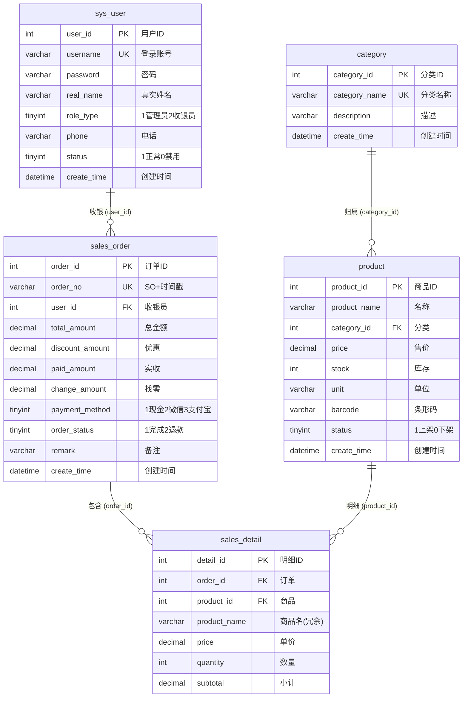
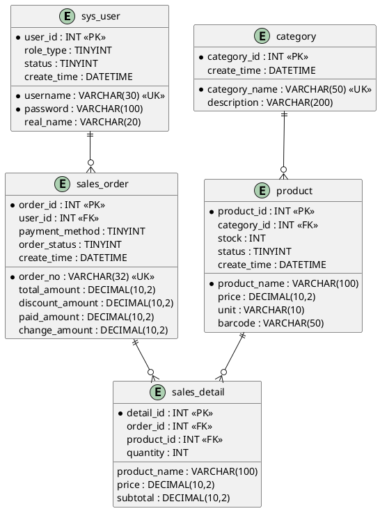

超市前台销售系统 — E-R 图
===========================

## 使用方式
- **Mermaid**: 复制到 https://mermaid.live 实时渲染
- **PlantUML**: IDEA 安装 PlantUML 插件后可直接预览
- **报告**: 截图后放入课程设计报告


## Mermaid 版




## PlantUML 版 (IDEA 原生支持)




## 关系汇总

```
         ┌──────────┐        ┌──────────────┐
         │ sys_user │ 1 ── N │ sales_order  │
         │  (用户)  │        │  (销售订单)  │
         └──────────┘        └──────┬───────┘
                                    │ 1
         ┌──────────┐               │        ┌──────────────┐
         │ category │ 1 ── N ┌──────┘  N ─── │ sales_detail │
         │  (分类)  │        │                │  (销售明细)  │
         └──────────┘   ┌────┴──────┐         └──────────────┘
                        │  product  │
                        │  (商品)   │
                        └───────────┘

外键：
  sales_order.user_id → sys_user.user_id
  product.category_id → category.category_id
  sales_detail.order_id → sales_order.order_id  (ON DELETE CASCADE)
  sales_detail.product_id → product.product_id
```
